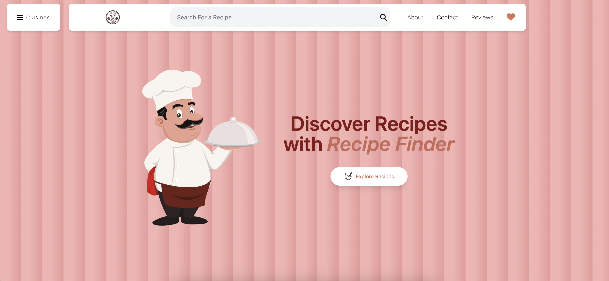
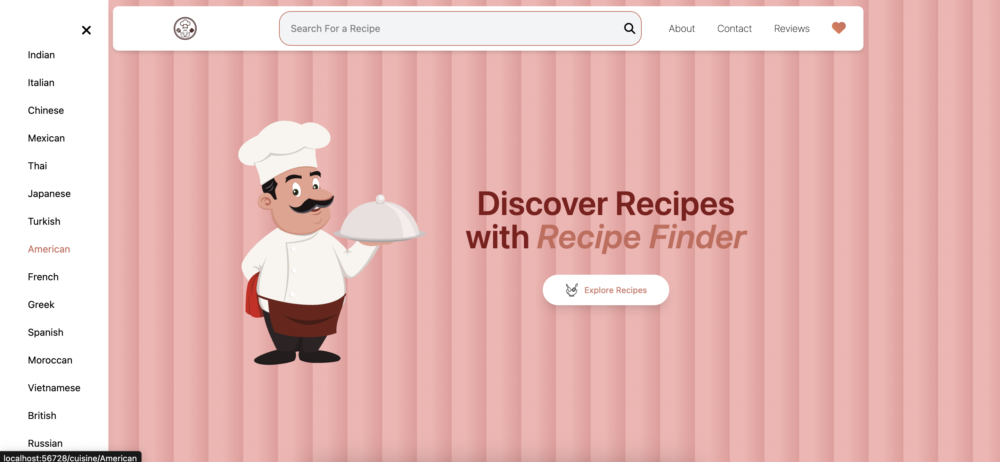
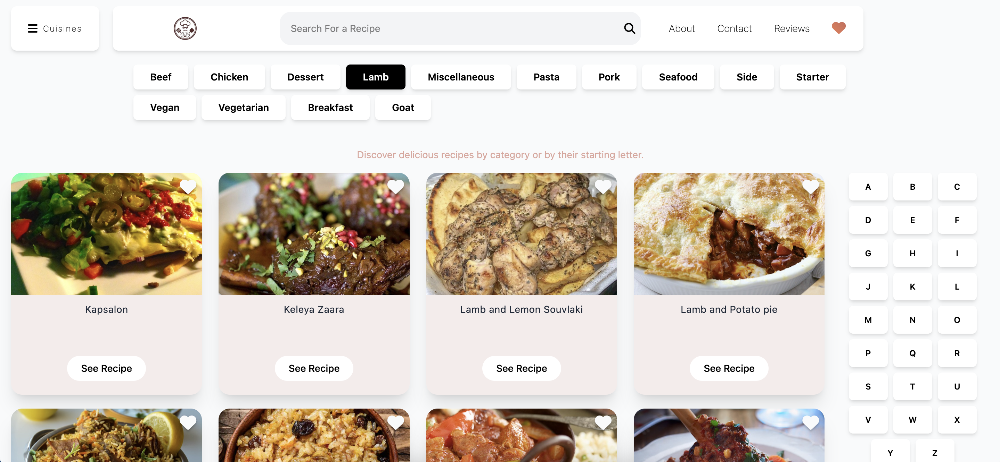
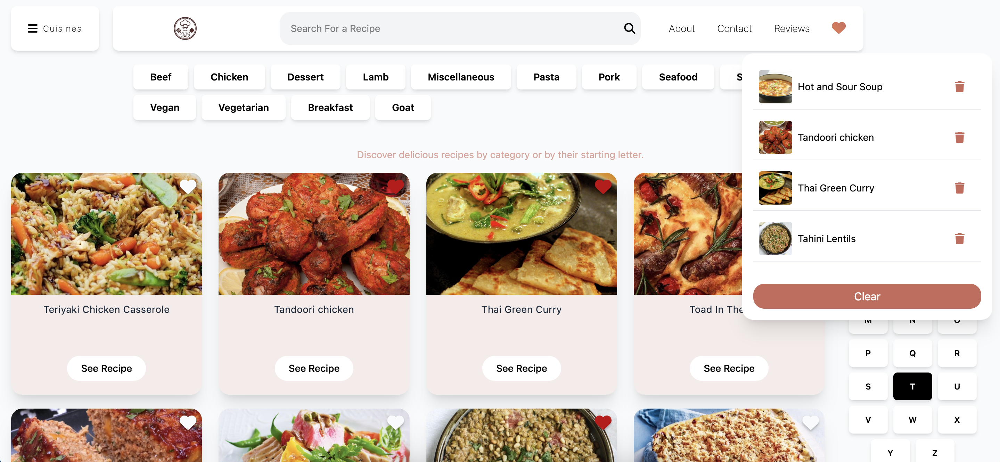
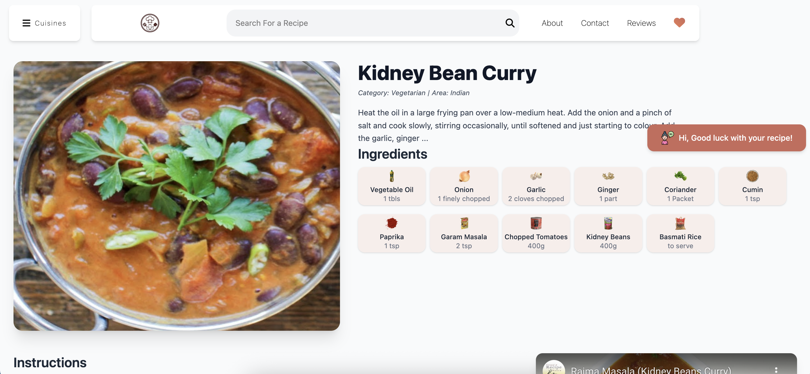
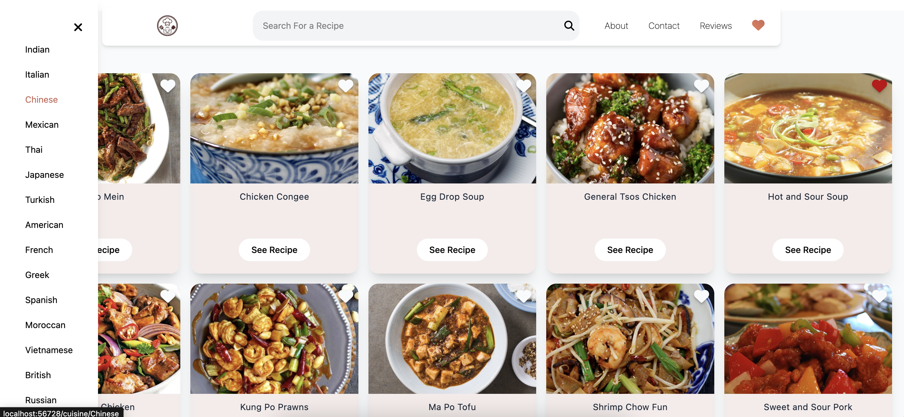
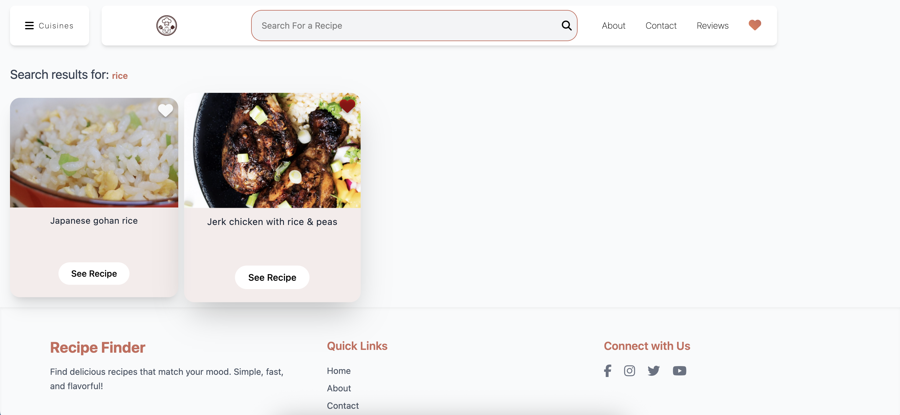
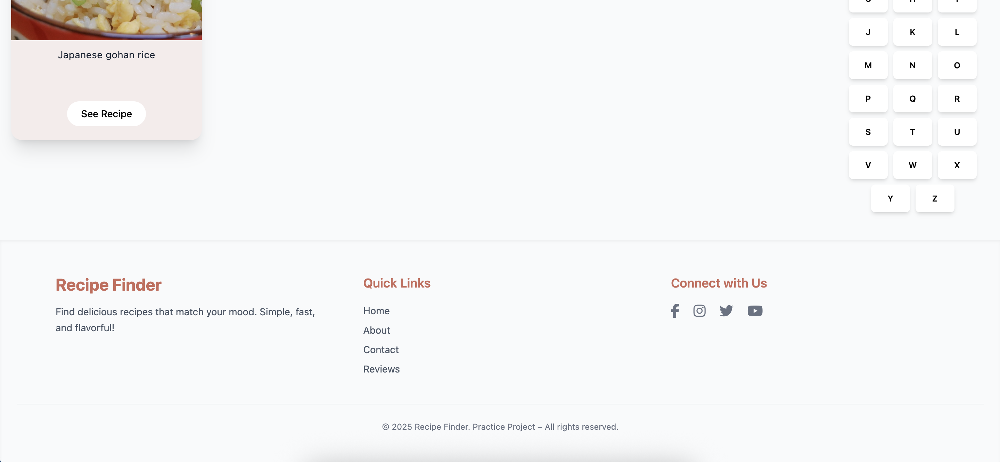

# ​​ Recipe Finder

A **responsive** web app to search and explore recipes from around the world using the [TheMealDB API](https://www.themealdb.com/api.php).  
You can search by name, browse categories, and view detailed cooking instructions. The app is live and easy to explore:

**🔗 Live Site:** https://recipefinder-web-app.web.app/

This project also includes **unit and integration testing** to ensure everything works smoothly.

---

## ​ Features
- **Search Recipes** – Find meals by name or category.
- **Recipe Details** – View ingredients, instructions, and images.
- **Responsive Design** – Works on mobile, tablet, and desktop.
- **Smooth Navigation** – Built with React Router for quick page switching.
- **State Management** – Managed with Redux Toolkit.
- **Animations** – Added with Motion for a smooth user experience.
- **Firebase Deploy** – Hosted online using Firebase Hosting.
- **Tested** – Includes unit and integration tests using Jest & React Testing Library.

---

## ​​ Tech Stack
**Frontend:**  
- React 19  
- React Router 7  
- Redux Toolkit  
- Tailwind CSS  
- Motion (animations)  
- React Scroll  

**Testing:**  
- Jest  
- React Testing Library  
- jsdom  

**Build Tools:**  
- Parcel  
- Babel  

**API:**  
- [TheMealDB API](https://www.themealdb.com/api.php)

---

## ​ Installation & Setup

1. **Clone the repository**
   ```bash
   git clone https://github.com/summbal122/Recipe-Finder.git
   cd Recipe-Finder


2. **Install dependencies**

   ```bash
   npm install
   ```

3. **Run the development server**

   ```bash
   npm start
   ```

4. **Run tests**

   ```bash
   npm test
   ```

5. **Build for production**

   ```bash
   npm run build
   ```

---

## Screenshots

Home Page                            



Recipes                          



Recipes Page


Cuisines Page                            


Searched Recipes                 


Footer                            


---
